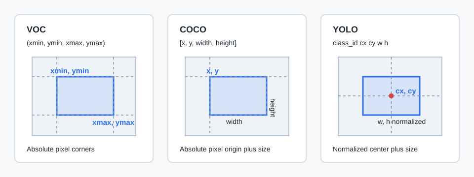
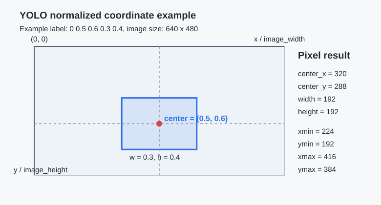

# VOC、COCO、YOLO 数据格式对比


## 总结一句话：

|格式|坐标表示|单条目标的框格式|
|------|----------|------------------|
|**VOC (Pascal VOC)**|`(xmin, ymin, xmax, ymax)`|左上角 + 右下角坐标（像素）|
|**COCO**|`[x, y, width, height]`|左上角 + 宽高（像素）|
|**YOLO**|`[center_x, center_y, w, h]`|归一化的中心点 + 宽高（0~1）|



---

## 1. VOC 格式（Pascal VOC）

### 坐标格式：
```python
{
  "bbox": [xmin, ymin, xmax, ymax]
}
```

- `xmin, ymin`：边界框左上角坐标（像素）
- `xmax, ymax`：边界框右下角坐标（像素）

### 特点：
- 使用**绝对像素坐标**
- 原点在图像左上角 `(0,0)`
- 框大小 = `(xmax - xmin, ymax - ymin)`

### 示例（XML 文件片段）：
```xml
<object>
    <name>cat</name>
    <bndbox>
        <xmin>100</xmin>
        <ymin>80</ymin>
        <xmax>300</xmax>
        <ymax>250</ymax>
    </bndbox>
</object>
```
表示一个从 `(100,80)` 到 `(300,250)` 的矩形框

---

## 2. COCO 格式（Common Objects in Context）

### 坐标格式：
```python
"bbox": [x, y, width, height]
```

- `x, y`：边界框**左上角坐标**（像素）
- `width, height`：边界框的宽和高（像素）

### 特点：
- 也是**绝对像素坐标**
- 和 VOC 不同的是：它用“左上角 + 宽高”表示
- 程序处理中很常见；如果用 `cv2.rectangle` 画框，通常需要先转换为 `(xmin, ymin)` 和 `(xmax, ymax)`

### JSON 示例：
```json
{
  "annotations": [
    {
      "image_id": 1,
      "category_id": 3,
      "bbox": [100, 80, 200, 170],
      "area": 34000,
      "iscrowd": 0,
      "id": 1
    }
  ]
}
```
等价于 VOC 的 `[100, 80, 300, 250]`

> 转换公式：
> ```
> xmin = x
> ymin = y
> xmax = x + width
> ymax = y + height
> ```

---

## 3. YOLO 格式（Darknet / Ultralytics）

### 坐标格式：
```txt
class_id center_x center_y w h
```

- `center_x, center_y`：边界框**中心点坐标**
- `w, h`：边界框的**宽度和高度**
- `class_id` 是类别编号，后面 4 个坐标值是**归一化到 [0,1] 的浮点数**

### 特点：
- 使用**相对坐标**（不是像素！）
- 归一化方式：
  - `center_x = 原始中心x / 图像宽度`
  - `center_y = 原始中心y / 图像高度`
  - `w = 宽度 / 图像宽度`
  - `h = 高度 / 图像高度`

### TXT 示例（一个文件一行一个框）：
```txt
0 0.5 0.6 0.3 0.4
```
表示：
- 类别 0
- 中心在图像 50% 宽、60% 高的位置
- 宽占图像 30%，高占 40%

### 转换为像素坐标（假设图像 640x480）：


```python
center_x = 0.5 * 640 = 320
center_y = 0.6 * 480 = 288
w = 0.3 * 640 = 192   → 半宽 96
h = 0.4 * 480 = 192   → 半高 96

xmin = 320 - 96 = 224
ymin = 288 - 96 = 192
xmax = 320 + 96 = 416
ymax = 288 + 96 = 384
```

---

## 三种格式对比表

|属性|VOC|COCO|YOLO|
|------|-----|------|------|
|坐标类型|绝对像素|绝对像素|**归一化相对值**|
|原点|左上角|左上角|左上角|
|表示方式|`(xmin,ymin,xmax,ymax)`|`(x,y,w,h)`|`(cx,cy,w,h)`|
|是否归一化|否|否|是（0~1）|
|文件格式|XML|JSON|TXT（每行一个框）|
|常见用途|Faster R-CNN|Mask R-CNN|YOLO系列（v5/v8）|

---

## 坐标转换工具函数（Python 示例）

```python
def voc_to_yolo(xmin, ymin, xmax, ymax, img_w, img_h):
    x = ((xmin + xmax) / 2) / img_w
    y = ((ymin + ymax) / 2) / img_h
    w = (xmax - xmin) / img_w
    h = (ymax - ymin) / img_h
    return x, y, w, h

def coco_to_voc(x, y, w, h):
    return x, y, x + w, y + h

def yolo_to_voc(cx, cy, w, h, img_w, img_h):
    xmin = (cx - w/2) * img_w
    ymin = (cy - h/2) * img_h
    xmax = (cx + w/2) * img_w
    ymax = (cy + h/2) * img_h
    return xmin, ymin, xmax, ymax
```

---

## 总结：记住关键区别

|问|答|
|----|----|
|VOC 的坐标是什么？|`(xmin, ymin, xmax, ymax)` 像素|
|COCO 的坐标是什么？|`(x, y, w, h)` 左上角 + 宽高（像素）|
|YOLO 的坐标是什么？|`(cx, cy, w, h)` **归一化**的中心点和宽高|
|哪个适合训练 YOLO 模型？|必须用 YOLO 格式（归一化中心坐标）|
|哪个适合 Faster R-CNN？|VOC 或 COCO 都可以|
