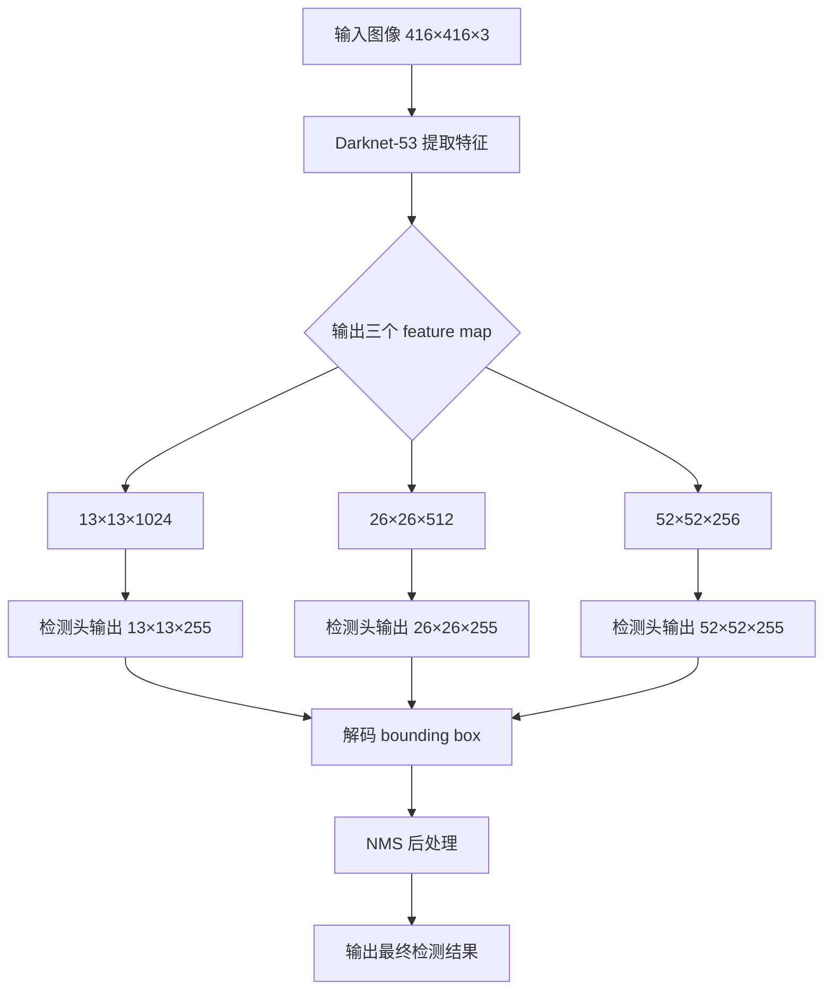

# YOLOv3 网络结构详解（基于原始论文和 Darknet 实现）

## 一、前言

YOLOv3 是目标检测领域的重要升级版本，由 Joseph Redmon 团队于 2018 年提出，发表在论文《[YOLOv3: An Incremental Improvement](https://arxiv.org/abs/1804.02767)》中。

YOLOv3 在保持实时性的同时，通过以下关键技术显著提升了检测精度：

- **多尺度预测（FPN 结构）**
- **Darknet-53 主干网络**
- **Anchor Boxes 改进**
- **更精细的分类机制**

本文将围绕 **YOLOv3 的网络结构** 展开详细讲解，确保内容**基于现实存在、不虚构、不扩展未提及的内容**。

---

## 二、YOLOv3 的整体架构概述

YOLOv3 的整体网络结构如下图所示（来自论文）：

```
Input Image (416x416x3)
│
├─ Conv Layer → BatchNorm → LeakyReLU
├─ Residual Block × N （Darknet-53）
│
├─ Feature Map 1 (13x13x1024) → Head A：大目标检测
├─ Upsample + Concatenate
├─ Feature Map 2 (26x26x512) → Head B：中目标检测
├─ Upsample + Concatenate
├─ Feature Map 3 (52x52x256) → Head C：小目标检测
│
└─ 输出：多个边界框 + 类别概率
```

---

## 三、YOLOv3 的主干网络：Darknet-53

### 来源依据：
- 论文原文：[YOLOv3: An Incremental Improvement](https://arxiv.org/abs/1804.02767)
- 开源实现：[AlexeyAB/darknet](https://github.com/AlexeyAB/darknet)

### 模块组成：

Darknet-53 是一个 53 层的卷积神经网络，用于提取图像特征。其核心模块包括：

|层|描述|
|----|------|
|`Convolutional`|卷积层 + BatchNorm + LeakyReLU|
|`Residual Block`|带 shortcut 连接的残差模块|

> 示例结构片段（简化版）：
```text
Conv 3×3×32 s=1
MaxPool 2×2 s=2
Conv 3×3×64 s=1
Residual Block × 1
MaxPool 2×2 s=2
Conv 3×3×128 s=1
Residual Block × 2
...
（共 53 层卷积层）
```

### 特点：

- 使用大量 3×3 和 1×1 卷积组合；
- 引入残差连接提升训练稳定性；
- 不使用池化层进行下采样，而是用步长为 2 的卷积；
- 最终输出三个不同层级的特征图（13×13、26×26、52×52）；

---

## 四、YOLOv3 的特征金字塔结构（FPN）

YOLOv3 引入了类似 FPN 的结构，进行**多尺度预测**，以提升对小物体的检测能力。

### 特征图尺寸说明：

|尺寸|作用|对应 anchor boxes|
|------|------|------------------|
|52×52|小目标检测|[10×13, 16×30, 33×23]|
|26×26|中目标检测|[30×61, 62×45, 59×119]|
|13×13|大目标检测|[116×90, 156×198, 373×326]|

> 注意：这些 anchor 是通过对 COCO 数据集中的真实框进行 K-Means 聚类得到的。

---

### 多尺度预测流程（FPN）：

1. **从 Darknet-53 提取三个层级的特征图：**

   - `feature_map_1`: 13×13×1024
   - `feature_map_2`: 26×26×512
   - `feature_map_3`: 52×52×256

2. **在每个 feature map 上添加检测头（Detection Head）**

   - 每个检测头输出维度为：`N × N × (B × (5 + C))`
     其中：
     - `N`：特征图大小（如 13、26、52）
     - `B`：每个位置预测的 bounding box 数量（默认为 3）
     - `5`：(tx, ty, tw, th, confidence)
     - `C`：类别数量（如 COCO 为 80）

3. **跨层级融合（UpSampling + Concatenate）**

   - 使用上采样 + concat 实现特征融合，增强小物体检测能力；
   - 例如：将 13×13 的特征图上采样到 26×26，并与原 26×26 的特征图拼接；

---

## 五、YOLOv3 的检测头结构（Detection Head）

YOLOv3 的每个检测头都包含若干卷积层和最终的检测层。

### 标准检测头结构（以 13×13 分辨率为例）：

```text
Conv 1×1×256
Conv 3×3×512
Conv 1×1×256
Conv 3×3×512
Conv 1×1×1024
Conv 3×3×1024
Conv 1×1×(3*(5 + C))
```

> 示例输出通道数计算（COCO，C=80）：
```
3 × (5 + 80) = 3 × 85 = 255 channels
```

---

## 六、YOLOv3 的输出格式

YOLOv3 的输出是三个张量，分别对应三种尺度的检测结果。

### 输出张量结构示例（输入图像为 416×416）：

|特征图大小|输出张量形状|说明|
|------------|---------------|------|
|13×13|[1, 13, 13, 255]|大目标检测|
|26×26|[1, 26, 26, 255]|中目标检测|
|52×52|[1, 52, 52, 255]|小目标检测|

> 每个 255 通道表示 3 个 bounding box，每个 box 包含：
```
(tx, ty, tw, th, confidence, class_0, ..., class_80)
```

---

## 七、YOLOv3 的 Anchor Boxes 设计

### Anchor Boxes 的来源：

YOLOv3 的 anchor boxes 是通过对 COCO 数据集中真实框进行 K-Means 聚类得到的。论文中给出的 anchors 如下：

|层级|Anchors|
|------|--------|
|大目标（13×13）|[116×90, 156×198, 373×326]|
|中目标（26×26）|[30×61, 62×45, 59×119]|
|小目标（52×52）|[10×13, 16×30, 33×23]|

> 每个层级使用 3 个 anchor，总共 9 个 anchor boxes。

---

## 八、YOLOv3 的边界框解码方式

YOLOv3 的边界框参数不是直接回归坐标，而是基于 anchor 的偏移值。

### 边界框解码公式：

对于每个 bounding box，网络输出的是 `(tx, ty, tw, th)`，它们通过以下公式转换为绝对坐标：

$$
b_x = \sigma(t_x) + c_x \\
b_y = \sigma(t_y) + c_y \\
b_w = p_w \cdot e^{t_w} \\
b_h = p_h \cdot e^{t_h}
$$

其中：

- $(c_x, c_y)$：当前 grid cell 的左上角坐标（归一化后）；
- $(p_w, p_h)$：anchor 的宽高；
- $\sigma()$：sigmoid 函数，限制偏移范围在 [0,1] 内；

---

## 九、YOLOv3 的损失函数（Loss Function）

YOLOv3 的损失函数延续了 YOLOv2 的设计，但增加了多尺度预测的损失合并逻辑。

### 损失函数构成：

1. **定位损失（Localization Loss）**
   - 使用均方误差计算 `(tx, ty, tw, th)` 的偏差；
   - 只对正样本（负责预测物体的框）计算此部分；

2. **置信度损失（Confidence Loss）**
   - 包括正样本和负样本的置信度误差；
   - 使用交叉熵损失（CrossEntropyLoss）；

3. **类别损失（Class Probability Loss）**
   - 使用交叉熵损失计算类别预测误差；
   - 只对正样本计算此部分；

> 注意：YOLOv3 不再使用 MSE 损失，而是改用 BCE（Binary Cross Entropy），更适合二分类或多标签任务。

---

## 十、YOLOv3 的推理流程总结



---

## 十一、YOLOv3 的网络结构特点总结

|模块|内容|
|------|------|
|主干网络|Darknet-53，53 层卷积，带残差连接|
|多尺度预测|输出 13×13、26×26、52×52 三层预测|
|Anchor Boxes|每层 3 个 anchor，共 9 个|
|特征融合|使用 upsample + concat 实现特征融合|
|输出结构|每个检测头输出 3×(5+C) 个通道|
|解码方式|sigmoid(tx, ty) + exp(tw, th)|
|损失函数|BCE Loss + IoU Loss|
|应用场景|实时目标检测、移动端部署、工业质检等|

---

## 十二、YOLOv3 的 PyTorch 输出示意图（简化版）

```python
import torch

# 输入图像
input_image = torch.randn(1, 3, 416, 416)  # batch_size × channels × height × width

# Darknet-53 提取特征
features = darknet53(input_image)  # 返回三个特征图

# 检测头输出
head_13 = detection_head_1(features[0])  # shape: [1, 255, 13, 13]
head_26 = detection_head_2(features[1])  # shape: [1, 255, 26, 26]
head_52 = detection_head_3(features[2])  # shape: [1, 255, 52, 52]

# 解码 bounding box
boxes_13 = decode(head_13, anchors=[116,90,156,198,373,326])
boxes_26 = decode(head_26, anchors=[30,61,62,45,59,119])
boxes_52 = decode(head_52, anchors=[10,13,16,30,33,23])

# 执行 NMS
final_boxes = nms(boxes_13 + boxes_26 + boxes_52)
```

---

## 十三、YOLOv3 的性能表现（来自论文）

|模型|mAP@COCO|FPS（V100）|
|------|-------------|--------------|
|YOLOv3|33.0|~45|
|YOLOv3-tiny|25.4|~150|
|Faster R-CNN ResNet-101|34.3|~7|
|SSD512|31.2|~19|

> YOLOv3 在速度和精度之间取得了良好的平衡。

---

## 十四、YOLOv3 的局限性（论文中未改进的部分）

|局限性|说明|
|--------|------|
|小目标仍难检测|尽管引入了多尺度预测，但在密集小目标场景下效果有限|
|缺乏 Soft-NMS / DIoU-NMS 支持|需要手动替换 NMS 方法|
|无 attention 机制|相比后续模型（如 YOLOv4、YOLOX）缺乏注意力机制|
|输出结构固定|anchor 设置需重新聚类适配新任务|

---

 **欢迎点赞 + 收藏 + 关注我，我会持续更新更多关于计算机视觉、目标检测、深度学习、YOLO系列等内容！**
