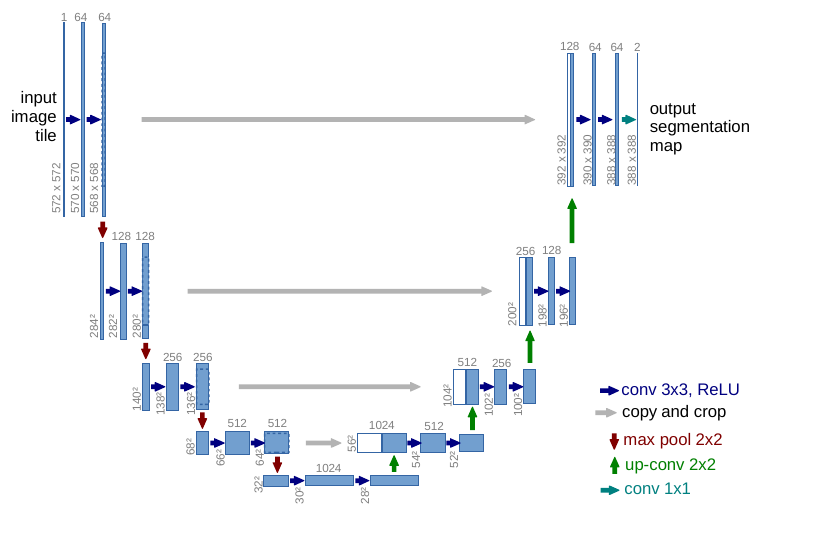

# U-Net 详解

> **论文：** U-Net: Convolutional Networks for Biomedical Image Segmentation  
> **作者：** Olaf Ronneberger, Philipp Fischer, Thomas Brox  
> **机构：** University of Freiburg, Germany  
> **发表：** MICCAI 2015  
> **arXiv：** https://arxiv.org/abs/1505.04597

---

## 1. 背景与动机

U-Net 最初是为**生物医学图像分割**设计的。在医学图像领域有两个痛点：

1. **标注数据稀缺** —— 医学图像的标注需要专业知识，数据量通常只有几十到几百张
2. **精度要求极高** —— 细胞、组织的边界必须分割得精确到像素级

U-Net 的解决方案：**在少量数据下也能训练出高精度的分割模型**，主要依靠：
- 强大的数据增强策略（尤其是弹性变形）
- Encoder-Decoder 的 U 形结构
- Skip Connection（跳跃连接）保留空间细节

---

## 2. 网络架构

### 2.1 整体结构

网络呈 **U 形**，由**收缩路径（Contracting Path）**和**扩展路径（Expansive Path）**组成：



> 图源：U-Net: Convolutional Networks for Biomedical Image Segmentation，Figure 1。

```
收缩路径 (Encoder)                 扩展路径 (Decoder)
      ↓                                 ↑
  输入图像                          分割结果
      │                                 │
  ┌───▼───┐    ┌─────────────┐    ┌─────┴─────┐
  │ Conv×2│───▶│  Bottleneck │───▶│ UpConv+   │
  │ +Pool │    │  Conv×2     │    │ Conv×2    │
  └───┬───┘    └──────┬──────┘    └─────┬─────┘
      │              │                  │
      │         Skip Connection ◀───────┘
      │         (crop + concat)
      ▼                                 ▲
  ┌───▼───┐    ┌─────────────┐    ┌─────┴─────┐
  │ Conv×2│───▶│  更大感受野  │───▶│ UpConv+   │
  │ +Pool │    │             │    │ Conv×2    │
  └───┬───┘    └──────┬──────┘    └─────┬─────┘
      │              │                  │
      │         Skip Connection ◀───────┘
      │              │                  │
      ▼              ▼                  ▲
  更小的特征图    最深的语义特征     逐步恢复分辨率
```

### 2.2 收缩路径（Contracting Path / Encoder）

收缩路径遵循典型的卷积网络结构：

- 每个层级包含：**2 个 3×3 卷积**（各接 ReLU）+ **1 个 2×2 Max Pooling**（步幅 2）
- 每次池化后：特征图尺寸**减半**，通道数**翻倍**
- 论文使用 **valid 卷积**（无 padding），所以卷积后尺寸会略微缩小

### 2.3 瓶颈层（Bottleneck）

- 位于 U 形底部
- 包含 **2 个 3×3 卷积** + ReLU
- 此时特征图尺寸最小（约输入尺寸的 1/16），通道数最多（1024）
- 代表最深的语义抽象

### 2.4 扩展路径（Expansive Path / Decoder）

扩展路径逐步恢复空间分辨率：

- 每个层级包含：**1 个 2×2 反卷积（转置卷积）**用于上采样 + **2 个 3×3 卷积**（各接 ReLU）
- 每次上采样后：特征图尺寸**翻倍**，通道数**减半**

### 2.5 Skip Connection（跳跃连接）

这是 U-Net 的**核心设计**：

```
Encoder 某层特征图              Decoder 对应层
  (高分辨率)                     (上采样后)
       │                            │
       │     crop                   │
       │    (裁剪对齐)               │
       └──────┐        ┌────────────┘
              │        │
              ▼        ▼
         ┌──────────────┐
         │  Concatenate │  ← 沿通道维度拼接
         │    (cat)     │
         └──────┬───────┘
                │
           ┌────▼────┐
           │ Conv 3×3│
           │ Conv 3×3│
           └─────────┘
```

**为什么需要 Skip Connection？**

- Encoder 经过多次下采样后，**空间细节（位置、边界）丢失严重**
- Decoder 上采样只能恢复**语义信息**，无法精确恢复**边界细节**
- Skip Connection 将 Encoder 的**高分辨率特征**直接送到 Decoder，让网络同时拥有：
  - **高层语义**（来自 Decoder 的上采样路径）
  - **低层细节**（来自 Encoder 的对应层）

**关于 crop：** 因为论文使用 valid 卷积（无 padding），Encoder 侧的特征图比 Decoder 对应层稍大，需要先裁剪到相同尺寸再拼接。

---

## 3. 关于输入输出尺寸

论文使用 valid 卷积，输入和输出尺寸不同。论文中给出的示例是输入 572×572，输出 388×388。

**注意：** 关于这个尺寸的具体计算过程，不同解读之间存在分歧（主要在于各层之间具体有多少个 valid 卷积操作）。本文不给出逐层尺寸推导，以避免误导。

**实际使用中**，大多数实现改用 **same padding**（padding=1），这样输入输出尺寸相同，更方便处理任意尺寸的图像。下文的代码实现即采用 same padding。

---

## 4. 训练策略

### 4.1 损失函数

使用**逐像素 Softmax + Cross Entropy**。

对于多类别语义分割，每个像素独立分类。

### 4.2 权重图（Weight Map）

这是 U-Net 针对**粘连目标**（如粘连细胞）的特殊设计：

- 对于分割边界附近的像素，在 loss 中赋予**更高的权重**
- 具体来说：计算每个像素到最近的两个不同目标边界的距离 d₁ 和 d₂
- 当像素位于两个目标的边界中间时（d₁ ≈ d₂ 且值较小），权重显著增大
- 这迫使网络在训练时更加关注区分粘连目标的边界

> **适用场景：** 这主要针对**实例分割**场景（需要分离不同个体）。对于普通语义分割任务（只分前景背景），可以不使用权重图。

### 4.3 数据增强

原文使用了非常激进的数据增强，这是**少量数据下成功的关键**：

- **随机弹性变形（Elastic Deformation）** —— 模拟生物组织的自然形变。通过在规则网格上施加随机位移场，然后用样条插值重采样图像
- **随机旋转、平移、翻转**

### 4.4 训练细节（论文原文描述的部分）

| 项目 | 值 |
|------|-----|
| 优化器 | SGD with Momentum |
| Momentum | 0.9 |
| 初始学习率 | 0.01 |
| 学习率策略 | 手动降低（论文未给出具体 schedule） |
| Batch Size | 1 |
| 输入 Patch | 572×572（受 GPU 内存限制） |
| 重叠采样 | 相邻 patch 有重叠，充分利用数据 |

---

## 5. 代码实现（PyTorch — Same Padding 版本）

> 这是实践中最常用的版本，使用 same padding，输入输出尺寸相同。
> 论文原版使用 valid 卷积，输出比输入小，但实际应用中 same padding 更实用。

```python
import torch
import torch.nn as nn
import torch.nn.functional as F


class DoubleConv(nn.Module):
    """两次 3×3 卷积 + BatchNorm + ReLU"""
    def __init__(self, in_channels, out_channels):
        super().__init__()
        self.double_conv = nn.Sequential(
            nn.Conv2d(in_channels, out_channels, kernel_size=3, padding=1),
            nn.BatchNorm2d(out_channels),
            nn.ReLU(inplace=True),
            nn.Conv2d(out_channels, out_channels, kernel_size=3, padding=1),
            nn.BatchNorm2d(out_channels),
            nn.ReLU(inplace=True),
        )

    def forward(self, x):
        return self.double_conv(x)


class UNet(nn.Module):
    def __init__(self, in_channels=1, num_classes=2):
        super().__init__()

        # ===== Encoder =====
        self.enc1 = DoubleConv(in_channels, 64)
        self.enc2 = DoubleConv(64, 128)
        self.enc3 = DoubleConv(128, 256)
        self.enc4 = DoubleConv(256, 512)

        # ===== Bottleneck =====
        self.bottleneck = DoubleConv(512, 1024)

        # ===== Decoder =====
        self.up4 = nn.ConvTranspose2d(1024, 512, kernel_size=2, stride=2)
        self.dec4 = DoubleConv(1024, 512)  # 512 (上采样) + 512 (skip) = 1024

        self.up3 = nn.ConvTranspose2d(512, 256, kernel_size=2, stride=2)
        self.dec3 = DoubleConv(512, 256)   # 256 (上采样) + 256 (skip) = 512

        self.up2 = nn.ConvTranspose2d(256, 128, kernel_size=2, stride=2)
        self.dec2 = DoubleConv(256, 128)   # 128 (上采样) + 128 (skip) = 256

        self.up1 = nn.ConvTranspose2d(128, 64, kernel_size=2, stride=2)
        self.dec1 = DoubleConv(128, 64)    # 64 (上采样) + 64 (skip) = 128

        # ===== Output =====
        self.out_conv = nn.Conv2d(64, num_classes, kernel_size=1)
        self.pool = nn.MaxPool2d(kernel_size=2, stride=2)

    def forward(self, x):
        # Encoder
        e1 = self.enc1(x)                    # [B, 64, H, W]
        e2 = self.enc2(self.pool(e1))        # [B, 128, H/2, W/2]
        e3 = self.enc3(self.pool(e2))        # [B, 256, H/4, W/4]
        e4 = self.enc4(self.pool(e3))        # [B, 512, H/8, W/8]

        # Bottleneck
        b = self.bottleneck(self.pool(e4))   # [B, 1024, H/16, W/16]

        # Decoder
        d4 = self.up4(b)                     # [B, 512, H/8, W/8]
        d4 = torch.cat([d4, e4], dim=1)      # [B, 1024, H/8, W/8]
        d4 = self.dec4(d4)                   # [B, 512, H/8, W/8]

        d3 = self.up3(d4)                    # [B, 256, H/4, W/4]
        d3 = torch.cat([d3, e3], dim=1)      # [B, 512, H/4, W/4]
        d3 = self.dec3(d3)                   # [B, 256, H/4, W/4]

        d2 = self.up2(d3)                    # [B, 128, H/2, W/2]
        d2 = torch.cat([d2, e2], dim=1)      # [B, 256, H/2, W/2]
        d2 = self.dec2(d2)                   # [B, 128, H/2, W/2]

        d1 = self.up1(d2)                    # [B, 64, H, W]
        d1 = torch.cat([d1, e1], dim=1)      # [B, 128, H, W]
        d1 = self.dec1(d1)                   # [B, 64, H, W]

        return self.out_conv(d1)             # [B, num_classes, H, W]


# 验证输入输出尺寸一致
if __name__ == "__main__":
    model = UNet(in_channels=1, num_classes=2)
    x = torch.randn(1, 1, 256, 256)
    y = model(x)
    print(f"输入: {x.shape} → 输出: {y.shape}")
    # 输出: torch.Size([1, 1, 256, 256]) → torch.Size([1, 2, 256, 256])
```

> **尺寸验证：** 使用 same padding 时，输入 H×W，输出也是 H×W。

---

## 6. U-Net 的主要变体

| 变体 | 核心改进 | 参考 |
|------|----------|------|
| **U-Net++** (2018) | 嵌套密集跳跃连接，在 encoder 和 decoder 之间加入多层密集连接 | Zhou et al., arXiv:1807.10165 |
| **Attention U-Net** (2018) | 在 skip connection 中加入注意力门，抑制无关区域 | Oktay et al., arXiv:1804.03999 |
| **ResUNet** | 用残差块替换普通卷积块 | — |
| **3D U-Net** (2016) | 将 2D 卷积替换为 3D 卷积，用于 3D 医学图像（CT/MRI） | Çiçek et al., arXiv:1606.06650 |

---

## 7. 优缺点总结

### ✅ 优点
- **少量数据下表现优异** —— 数据增强 + 端到端训练
- **边界分割精确** —— Skip Connection 保留空间细节
- **结构简单清晰** —— 容易理解和实现
- **通用性强** —— 已成为医学图像分割的标准 backbone

### ❌ 局限
- **感受野有限** —— 相比后续模型（如 DeepLab 的 ASPP），深层语义信息可能不够丰富
- **计算量大** —— 全分辨率 skip connection 带来较高的内存占用
- **原论文仅适用于 2D** —— 3D 需要专门修改
- **没有多尺度特征融合** —— 后续模型通过 ASPP、金字塔池化等机制弥补了这一点

---

## 8. 一句话总结

> **U-Net = Encoder（提取语义） + Skip Connection（保留细节） + Decoder（恢复分辨率）**
>
> 它的核心思想是：下采样捕捉全局语义，上采样恢复空间分辨率，中间用跳跃连接把高分辨率的细节特征直接送到解码端，两者结合实现精确的像素级分割。
