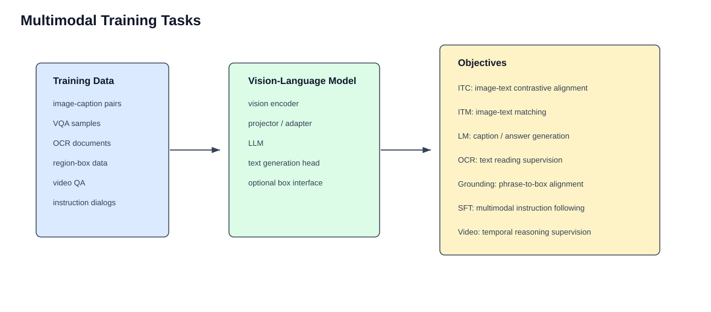
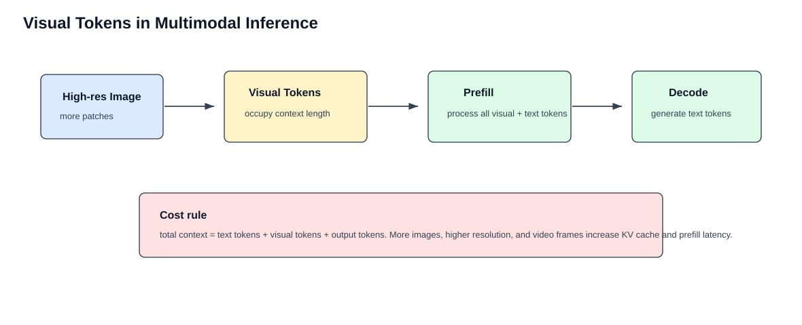

# Qwen-VL 模型结构与训练推理详解

Qwen-VL 是 Qwen 系列的大视觉语言模型分支。它的目标不是只做图像描述，而是让语言模型具备更完整的视觉理解能力，包括：

- 图像描述；
- 视觉问答；
- OCR / 文档理解；
- 目标定位；
- 多图对话；
- 图像中的文字读取；
- 图文混合理解和推理。

可以把 Qwen-VL 看作一条持续演进的多模态路线：

```text
Qwen-VL
  -> Qwen-VL-Chat
  -> Qwen2-VL
  -> Qwen2.5-VL
```

其中早期 Qwen-VL 重点解决“如何让 Qwen 语言模型看懂图像”；Qwen2-VL 之后进一步强调动态分辨率、视频理解、视觉 Agent 和多语言能力；Qwen2.5-VL 继续强化视频、文档、定位和视觉推理能力。


## 一、Qwen-VL 要解决什么问题

纯文本大语言模型只能处理 token 序列：

```text
文本
  -> tokenizer
  -> token ids
  -> LLM
  -> 文本输出
```

但图像不是 token 序列。要让 LLM 看懂图像，需要解决三个问题：

1. 图像如何编码成视觉特征；
2. 视觉特征如何变成 LLM 能理解的 token-like 表示；
3. 模型如何学会图像、文本、位置框之间的对齐关系。

Qwen-VL 的整体思路是：

```text
Image
  -> Vision Encoder
  -> Visual Features
  -> Visual Adapter / Projector
  -> Visual Tokens
  -> Qwen Language Model
  -> Text / Box Output
```

## 二、Qwen-VL 的整体结构

Qwen-VL 建立在 Qwen 语言模型之上，给它增加视觉输入能力。

简化结构如下：

```text
输入图片
  -> Vision Transformer
  -> 图像 patch 特征
  -> 视觉适配模块
  -> 压缩/映射后的视觉 token
  -> 与文本 token 拼接
  -> Qwen LLM
  -> 输出文本或坐标
```

它包含几个关键模块：

| 模块 | 作用 |
|---|---|
| Vision Encoder | 把图像转成 patch-level 视觉特征 |
| Visual Adapter / Receptor | 把视觉特征压缩并映射到语言模型空间 |
| Qwen LLM | 负责语言理解、推理和生成 |
| Input-Output Interface | 支持图像、文本、框输入，也支持文本和框输出 |
| Training Pipeline | 通过多阶段训练建立图文和定位能力 |

## 三、Vision Encoder

Vision Encoder 通常使用 ViT 类结构。

图像输入后，会被切成 patch：

```text
Image
  -> patchify
  -> patch embeddings
  -> Vision Transformer
  -> visual features
```

如果图像尺寸较大，patch 数量也会增多。视觉 token 越多，LLM 后续处理成本越高。

所以多模态模型经常需要一个视觉压缩或映射模块，避免把过多 patch token 直接塞给 LLM。

## 四、Visual Adapter / Visual Receptor

Qwen-VL 论文中提到给 Qwen-LM 增加视觉能力时，设计了 visual receptor、input-output interface 和多阶段训练流程。

Visual Adapter 的任务是：

```text
Vision Encoder 输出的视觉特征
  -> 映射到 LLM hidden size
  -> 变成 LLM 可以接收的视觉 token
```

它类似其他多模态模型中的 projector、adapter、resampler 或 Q-Former，核心都是连接视觉编码器和语言模型。

不同模型的连接方式可以这样对比：

| 模型 | 连接方式 | 说明 |
|---|---|---|
| LLaVA | MLP Projector | 把 CLIP 视觉特征映射到 LLM hidden size |
| BLIP-2 | Q-Former | 用 learnable query 压缩视觉信息 |
| Flamingo | Cross-Attention | 在语言模型层中插入跨模态注意力 |
| Qwen-VL | Visual Receptor / Adapter | 将视觉特征转成可被 Qwen-LM 处理的输入 |

## 五、输入输出接口

Qwen-VL 的一个特点是接口不只支持图文问答，还支持位置相关输入输出。

输入可以包括：

```text
文本
图片
bounding box
```

输出可以包括：

```text
文本回答
目标位置框
图像区域描述
```

这使它不仅能回答：

```text
这张图里有什么？
```

也能回答：

```text
图中红色汽车在哪里？
请框出图片中的文字区域。
这张图中招牌写了什么？
```

## 六、Grounding 能力

Grounding 指的是把语言描述和图像区域对应起来。

例如：

```text
用户: 找到图中的狗
模型: <box>(x1, y1), (x2, y2)</box>
```

或者：

```text
用户: 这个框里的物体是什么？
输入: image + box
模型: 一只猫
```

Grounding 的关键不是只识别类别，而是建立：

```text
文本短语 <-> 图像区域
```

之间的对齐。

Qwen-VL 通过 image-caption-box 这类数据让模型学习图像、描述和位置框之间的关系。

## 七、OCR 和文档理解能力

Qwen-VL 很强调 text reading，也就是读图中文字。

OCR 能力在多模态模型中很重要，因为很多真实任务不是普通自然图片，而是：

- 截图；
- 表格；
- 海报；
- 发票；
- 证件；
- 网页；
- 文档；
- 商品包装。

这类任务需要模型既能看图，又能理解文字内容。

普通图像描述模型可能只会说：

```text
这是一张菜单图片。
```

而 OCR 能力较强的 VLM 应该能回答：

```text
菜单里牛肉面的价格是多少？
```

这要求模型对小字、排版、区域关系和语义都有更强感知。

## 八、Qwen-VL 的三阶段训练

Qwen-VL 论文强调了三阶段训练流程。可以简化理解为：



```text
Stage 1: 图文对齐预训练
Stage 2: 多任务视觉语言预训练
Stage 3: 指令微调 / 对话微调
```

### 1. Stage 1：图文对齐

目标是让视觉特征能接入语言模型。

```text
image-caption pairs
  -> Vision Encoder
  -> Visual Adapter
  -> Qwen LLM
  -> caption/text prediction
```

这一阶段重点是建立基础图文语义对齐。

### 2. Stage 2：多任务预训练

这一阶段引入更多任务类型：

- image caption；
- VQA；
- OCR；
- grounding；
- 文档理解；
- 多语言图文数据。

目标是让模型不只会描述图片，还能回答问题、读文字、定位区域。

### 3. Stage 3：指令微调

Qwen-VL-Chat 这类模型需要具备对话能力，因此要用多模态指令数据做 SFT。

训练格式类似：

```text
用户: <image> 请描述这张图。
助手: 这张图展示了...
```

或者：

```text
用户: <image> 图片中左上角的文字是什么？
助手: ...
```

指令微调的目标是让模型学会按照用户问题作答，而不是只做预训练式补全。

## 九、Qwen2-VL 的关键改进

Qwen2-VL 是 Qwen-VL 的重要升级版本。它的几个关键词是：

- Naive Dynamic Resolution；
- M-ROPE；
- 图像和视频统一处理；
- 视觉 Agent 能力；
- 多语言视觉理解。

### 1. Naive Dynamic Resolution

传统 VLM 往往把所有图像 resize 到固定尺寸，例如：

```text
224x224
336x336
448x448
```

固定尺寸有问题：

- 大图会丢细节；
- 小图会被不必要放大；
- 文档和截图中的小字容易模糊；
- 不同宽高比会被压缩或裁剪。

Qwen2-VL 的动态分辨率思想是：根据图像实际尺寸和内容，动态映射成不同数量的视觉 token。

```text
小图 -> 较少 visual tokens
大图/高分辨率图 -> 较多 visual tokens
```

好处是：

- 更好保留图像细节；
- OCR 和文档任务更受益；
- 输入 token 数和图像信息量更匹配。

代价是：

- 高分辨率图像会产生更多视觉 token；
- 推理显存和速度压力更高；
- 多图输入时上下文更容易变长。

### 2. M-ROPE

M-ROPE 是 Multimodal Rotary Position Embedding。

普通文本 RoPE 只处理一维 token 位置：

```text
token 1, token 2, token 3, ...
```

但视觉输入天然有二维结构：

```text
height, width
```

视频还有时间维度：

```text
time, height, width
```

M-ROPE 的目的就是让模型同时理解：

- 文本的一维位置；
- 图像的二维空间位置；
- 视频的时间维度。

可以简化为：

```text
Text: 1D position
Image: 2D position
Video: 3D position
```

这对多图、视频、文档布局理解都很重要。

## 十、Qwen2.5-VL 的进一步升级

Qwen2.5-VL 在 Qwen2-VL 基础上进一步强化了视觉理解和视频能力。根据官方和 Transformers 文档，它的重点包括：

- 3B、7B、72B 等规模；
- 预训练 token 量更大；
- ViT 中引入 window attention；
- 动态 FPS 采样；
- 升级后的 MRoPE；
- 更强的视频和时序理解。

### 1. Window Attention

全局 attention 对高分辨率视觉 token 很贵。

Window Attention 把图像 token 分到局部窗口中计算 attention：

```text
Image Tokens
  -> split into windows
  -> attention inside each window
  -> optional global/full attention layers
```

作用：

- 降低视觉编码器计算量；
- 提高训练和推理速度；
- 适合高分辨率图像和视频帧。

### 2. Dynamic FPS Sampling

视频输入不仅有空间维度，还有时间维度。

如果固定抽帧：

```text
每秒固定抽 N 帧
```

可能出现：

- 快动作视频信息不够；
- 慢动作视频 token 浪费；
- 长视频上下文过长。

Dynamic FPS Sampling 会根据视频时长、采样率和任务需求更灵活地控制视觉 token。

### 3. 更强的时间位置建模

视频理解需要知道：

```text
哪个事件先发生
哪个事件后发生
物体如何移动
动作如何变化
```

升级后的 MRoPE 让模型更好处理时间动态，而不是把视频帧当成互不相关的图片。

## 十一、Qwen-VL 和 BLIP-2 / LLaVA 的区别

### 1. 和 BLIP-2 的区别

BLIP-2 的核心是 Q-Former：

```text
Frozen ViT
  -> Q-Former
  -> Frozen LLM
```

它强调参数高效地连接冻结视觉模型和冻结语言模型。

Qwen-VL 更强调把 Qwen 语言模型扩展成通用视觉语言模型，并支持：

- OCR；
- grounding；
- box 输入输出；
- 多语言图文任务。

### 2. 和 LLaVA 的区别

LLaVA 的结构更接近：

```text
CLIP Vision Encoder
  -> MLP Projector
  -> LLaMA / Vicuna
```

它用图文指令数据把视觉特征接入 LLM，结构非常清晰。

Qwen-VL 系列则更强调端到端的视觉能力覆盖，尤其是 OCR、定位和多语言能力。

## 十二、推理阶段流程

Qwen-VL 推理可以简化为：



```text
用户输入 image + prompt
  -> Processor 处理图片和文本
  -> 图片变成 pixel_values / visual tokens
  -> 文本变成 input_ids
  -> visual tokens 插入到文本序列对应位置
  -> LLM 自回归生成
  -> 输出文本或坐标
```

### 1. 视觉 token 会占上下文

多模态模型里，图片不是免费输入。它会变成视觉 token，占用上下文长度。

```text
总上下文 = 文本 token + 视觉 token + 输出 token
```

高分辨率、多图、视频都会显著增加视觉 token 数量。

### 2. Prefill 更重

纯文本 prompt 可能只有几百 token。

多模态 prompt 可能是：

```text
文本 token: 100
图片 token: 1000
```

因此首 token 延迟通常更高，因为 prefill 阶段要先处理大量视觉 token。

### 3. Decode 和普通 LLM 类似

一旦视觉信息进入上下文，后续 decode 阶段仍然是自回归生成：

```text
生成 token1
  -> 追加到上下文
  -> 生成 token2
  -> ...
```

KV Cache 中会保存文本和视觉上下文对应的 K/V。

## 十三、Qwen-VL 常见任务

| 任务 | 例子 | 关键能力 |
|---|---|---|
| Image Caption | 描述图片内容 | 场景理解 |
| VQA | 图中有几个人？ | 图文问答 |
| OCR | 招牌上写了什么？ | 文字读取 |
| DocVQA | 发票金额是多少？ | 文档理解 |
| Grounding | 框出红色汽车 | 语言到区域 |
| Region QA | 这个框里是什么？ | 区域到语言 |
| Multi-image QA | 比较两张图差异 | 多图对比 |
| Video QA | 视频中发生了什么？ | 时间理解 |
| Visual Agent | 根据屏幕执行操作 | 视觉定位和指令执行 |

## 十四、关键名词说明

| 名词 | 说明 |
|---|---|
| VLM / LVLM | 视觉语言模型 / 大视觉语言模型 |
| Vision Encoder | 图像编码器，把图片转成视觉特征 |
| Visual Token | 视觉特征映射到 LLM 后形成的 token-like 表示 |
| Projector / Adapter | 连接视觉编码器和语言模型的映射层 |
| Grounding | 文本和图像区域之间的定位对齐 |
| OCR | 图像文字识别 |
| Dynamic Resolution | 根据图像实际大小动态生成视觉 token |
| M-ROPE / MRoPE | 多模态旋转位置编码 |
| Window Attention | 在局部窗口内做 attention，降低视觉计算量 |
| Dynamic FPS | 视频中动态控制抽帧和时间 token |
| Multimodal Instruction Tuning | 多模态指令微调 |

## 十五、学习 Qwen-VL 的主线

可以按下面这条线理解：

```text
CLIP:
  图文对比，学习图文相似度

BLIP / BLIP-2:
  图文理解和生成，Q-Former 连接视觉与语言模型

LLaVA:
  CLIP + Projector + LLM，强调指令微调

Qwen-VL:
  在 Qwen LLM 上扩展视觉输入，强调 OCR、grounding、多语言、多图对话

Qwen2-VL / Qwen2.5-VL:
  动态分辨率、M-ROPE、视频理解、视觉 Agent 和更强部署可用性
```

Qwen-VL 系列的核心价值是：它不是只做“看图说话”，而是把图像、文字、位置框和对话统一到一个语言模型接口中。

## 十六、能力边界和注意点

### 1. OCR 强不等于完全可靠

模型能读图中文字，但小字、模糊、倾斜、遮挡、复杂表格仍可能出错。高风险场景需要 OCR 引擎或规则校验辅助。

### 2. Grounding 不等于专业检测器

Qwen-VL 可以输出框，但如果任务是工业级检测，专用检测模型仍然更稳定、更快、更可控。

### 3. 高分辨率输入会增加成本

动态分辨率提升细节理解，但视觉 token 更多，推理成本也更高。

### 4. 视频理解受采样影响

视频模型看到的是采样后的帧和时间 token。抽帧策略不同，模型能看到的信息也不同。

### 5. 多图对比比单图问答更难

多图输入需要模型保持不同图像的上下文边界，并在图像之间做对比和引用。

## 十七、参考资料

- Qwen-VL 论文：Qwen-VL: A Versatile Vision-Language Model for Understanding, Localization, Text Reading, and Beyond
- Qwen-VL 官方仓库：https://github.com/QwenLM/Qwen-VL
- Qwen2-VL 官方介绍：https://qwen2.org/vl/
- Hugging Face Transformers Qwen2-VL 文档：https://huggingface.co/docs/transformers/model_doc/qwen2_vl
- Hugging Face Transformers Qwen2.5-VL 文档：https://huggingface.co/docs/transformers/model_doc/qwen2_5_vl
