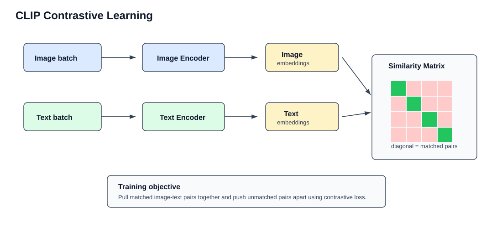

## 📚 CLIP 训练流程（从 0 开始）

### 1. **目标**
- **核心目标**：训练一个模型，使得“图像”和“描述这个图的文本”在向量空间中尽可能接近。
- **最终效果**：模型能够将图像和文本映射到同一个语义空间，从而实现跨模态理解。

---

### 2. **数据准备**

#### 数据来源：
- 假设我们有 **1000 万条图文对数据**，每条数据包含一张图片及其对应的文本描述。
- 示例数据如下：

| 图片 | 文本描述 |
|------|----------|
| 🐶 一只拉布拉多犬 | “A yellow Labrador dog on grass” |
| 🏀 打篮球的人 | “A person playing basketball” |
| 🚗 红色跑车 | “A red sports car on the road” |

#### 数据特点：
- 图像和文本是自然匹配的（即文本准确描述了图像内容）。
- 数据规模大，来源于互联网（如网页、社交媒体等）。

---

### 3. **模型结构**



CLIP 包含两个主要编码器：

| 模块 | 模型类型 | 输入 | 输出 |
|------|----------|------|------|
| 图像编码器 | ViT / ResNet | 一张图片 | 图像向量 $ v_{\text{img}} $ |
| 文本编码器 | Transformer | 一段文字 | 文本向量 $ v_{\text{txt}} $ |

#### 关键点：
- **图像编码器**：提取图像的视觉特征，通常使用 ViT 或 ResNet。
- **文本编码器**：提取文本的语言特征，基于 Transformer 结构。
- **输出**：每个编码器都将输入转换为固定维度的向量表示（如 512 维或 768 维）。

---

### 4. **训练过程（对比学习）**

#### 假设：
- 我们使用一个 batch 大小为 4 的训练样本。
- 每个 batch 包含 4 张图像及其对应的正确文本描述。

#### 示例 batch 数据：

| 图像 ID | 图像 | 正确描述文本 |
|---------|------|--------------|
| 1       | 🐱   | “A cat on a sofa” |
| 2       | 🚲   | “A person riding a bike” |
| 3       | 🍕   | “A delicious slice of pizza” |
| 4       | 🏔️   | “A snow mountain landscape” |

#### 训练步骤：

##### **Step 1：编码图像和文本**
- 使用图像编码器处理 4 张图像，得到图像向量：
  $$
  v_{\text{img}} = [v_{\text{img1}}, v_{\text{img2}}, v_{\text{img3}}, v_{\text{img4}}]
  $$
  - 每个 $ v_{\text{imgi}} $ 是一个形状为 $(D)$ 的向量（如 $ D = 512 $）。

- 使用文本编码器处理 4 条文本，得到文本向量：
  $$
  v_{\text{txt}} = [v_{\text{txt1}}, v_{\text{txt2}}, v_{\text{txt3}}, v_{\text{txt4}}]
  $$
  - 每个 $ v_{\text{txti}} $ 也是一个形状为 $(D)$ 的向量。

##### **Step 2：计算相似度矩阵**
- 将图像向量和文本向量进行点积运算，得到相似度矩阵 $ S $：
  $$
  S = v_{\text{img}} \cdot v_{\text{txt}}^\top
  $$
  - $ S $ 是一个 $ 4 \times 4 $ 的矩阵，其中 $ S_{ij} $ 表示第 $ i $ 张图像与第 $ j $ 条文本的相似度。

##### **Step 3：构造正负样本**
- **正样本**：正确的图文对（对角线元素），例如：
  - 图像 1 对应文本 1：“A cat on a sofa”
  - 图像 2 对应文本 2：“A person riding a bike”
  - ...
- **负样本**：错误的图文对（非对角线元素），例如：
  - 图像 1 对应文本 2：“A person riding a bike”（错误匹配）

##### **Step 4：计算对比损失（Contrastive Loss）**
- 使用 **InfoNCE Loss** 优化模型，公式如下：
  $$
  \mathcal{L} = -\frac{1}{N}\sum_{i=1}^{N} \log \frac{\exp(s_{ii}/\tau)}{\sum_{j=1}^{N} \exp(s_{ij}/\tau)}
  $$
  - $ s_{ij} $：相似度矩阵中的元素，表示第 $ i $ 张图像与第 $ j $ 条文本的相似度。
  - $ \tau $：温度参数（通常取值为 0.07）。
  - 目标：最大化正样本的相似度，最小化负样本的相似度。

##### **Step 5：反向传播与优化**
- 根据损失函数 $\mathcal{L}$，通过反向传播更新图像编码器和文本编码器的参数。
- 使用优化器（如 AdamW）进行梯度更新。

---

### 5. **训练循环**

#### 重复上述步骤：
1. 随机采样一个新的 batch 数据。
2. 编码图像和文本。
3. 计算相似度矩阵。
4. 构造正负样本。
5. 计算对比损失。
6. 反向传播优化参数。

#### 注意事项：
- **大规模数据**：CLIP 使用了约 4 亿个图文对进行训练，因此需要强大的计算资源。
- **无监督学习**：整个训练过程不需要人工标注标签，完全依赖自然语言监督。

---

### 6. **训练结果**

经过大量迭代后：
- 图像编码器和文本编码器会逐渐学会将图像和文本映射到同一个语义空间。
- 正确的图文对在向量空间中的距离会变得更近，而错误的图文对距离会变得更远。

---

### 7. **总结**

CLIP 的训练流程可以概括为以下几步：
1. **数据准备**：收集大量的图文对数据。
2. **模型构建**：使用 ViT/ResNet 和 Transformer 分别处理图像和文本。
3. **对比学习**：通过 InfoNCE Loss 优化模型，使正确的图文对更接近。
4. **迭代优化**：不断调整编码器参数，直到模型收敛。

---

### 8. **延伸思考**

- 如果没有对比学习，CLIP 能否完成任务？
- CLIP 的训练是否需要人工标注？为什么？
- 如何衡量 CLIP 的训练效果？

---

### 9. **可视化建议**

为了更好地讲解，可以配合以下图表：

1. **训练数据示例**：
   ```
   | 图片 | 文本描述 |
   |------|----------|
   | 🐶   | “A yellow Labrador dog on grass” |
   | 🏀   | “A person playing basketball” |
   | 🚗   | “A red sports car on the road” |
   ```

2. **模型结构图**：
   ```
          [图像]             [文本]
            ↓                  ↓
        图像编码器           文本编码器
            ↓                  ↓
         图像向量 v_img      文本向量 v_txt
            \                /
             \              /
              \            /
               [对比学习 Loss]
   ```

3. **相似度矩阵示意图**：
   ```
   S = [
       [s11, s12, s13, s14],
       [s21, s22, s23, s24],
       [s31, s32, s33, s34],
       [s41, s42, s43, s44]
   ]
   ```
   - 对角线元素 $ s_{ii} $ 是正样本，其他是非正样本。

---
