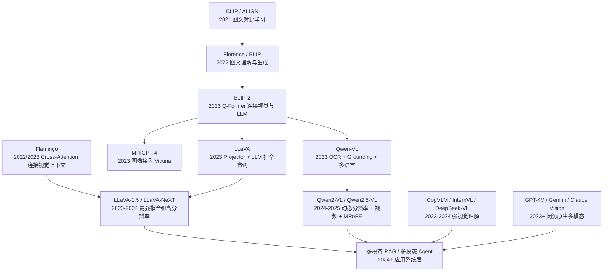

# 多模态模型发展顺序

多模态模型的发展主线可以理解为：

```text
图文对齐
  -> 图文理解和生成
  -> 视觉特征接入大语言模型
  -> 多模态对话和指令微调
  -> OCR / Grounding / 视频 / Agent 能力增强
  -> 原生多模态和多模态系统应用
```

早期多模态模型更关注“图片和文字是否匹配”；后来的多模态大模型更关注“能不能像语言模型一样，围绕图片、文档、视频进行对话、推理和操作”。

## 一、模型衍生顺序图



这张图不是严格的论文引用关系，而是学习路线上的技术演进关系。

## 二、多模态模型发展阶段总览

| 阶段 | 时间 | 代表模型 | 核心问题 | 典型能力 |
|---|---|---|---|---|
| 图文对齐阶段 | 2021 | CLIP、ALIGN | 图片和文本如何进入同一语义空间 | 图文检索、零样本分类 |
| 图文理解生成阶段 | 2022 | BLIP、Florence | 如何同时做理解和生成 | Caption、VQA、图文匹配 |
| 视觉连接 LLM 阶段 | 2022-2023 | Flamingo、BLIP-2 | 如何把视觉特征接入大语言模型 | 图像问答、少样本多模态任务 |
| 多模态对话阶段 | 2023 | MiniGPT-4、LLaVA | 如何让模型按照用户指令看图对话 | 图文对话、视觉指令跟随 |
| OCR 与 Grounding 增强阶段 | 2023 | Qwen-VL、CogVLM | 如何读文字、定位区域、理解框 | OCR、文档问答、目标定位 |
| 高分辨率和视频阶段 | 2024-2025 | Qwen2-VL、Qwen2.5-VL、InternVL2 | 如何处理动态图像尺寸和视频时间信息 | 多图、视频问答、长视觉上下文 |
| 原生多模态阶段 | 2023+ | GPT-4V、Gemini、Claude Vision | 如何统一文本、图像、音频、视频等模态 | 多模态推理、工具调用、复杂任务 |
| 应用系统阶段 | 2024+ | 多模态 RAG、多模态 Agent | 如何接入检索、工具、GUI、业务流程 | 文档助手、视觉质检、屏幕 Agent |

## 三、第一阶段：图文对齐

代表模型：

```text
CLIP
ALIGN
```

这一阶段的核心是对比学习。

模型同时编码图片和文本：

```text
Image
  -> Image Encoder
  -> image embedding

Text
  -> Text Encoder
  -> text embedding
```

训练目标是：

```text
匹配的图文对距离更近
不匹配的图文对距离更远
```

CLIP 的重要意义是：它让视觉模型具备了开放词汇能力。

例如不用重新训练分类头，也可以用文本提示做分类：

```text
"a photo of a cat"
"a photo of a dog"
"a photo of a car"
```

但 CLIP 本身不是对话模型，也不擅长生成详细回答。

## 四、第二阶段：图文理解和生成

代表模型：

```text
BLIP
Florence
```

这一阶段开始把图文匹配、图像描述、视觉问答放到更统一的框架里。

BLIP 的典型能力包括：

- Image-Text Contrastive；
- Image-Text Matching；
- Image Captioning；
- VQA。

它相比 CLIP 更进一步：不只是判断图文是否匹配，还能生成文本描述。

## 五、第三阶段：视觉特征连接 LLM

代表模型：

```text
Flamingo
BLIP-2
```

这一阶段的核心问题是：

```text
已经有强大的视觉模型和强大的语言模型，如何低成本连接起来？
```

### 1. BLIP-2

BLIP-2 使用 Q-Former 连接视觉编码器和语言模型：

```text
Frozen Vision Encoder
  -> Q-Former
  -> Frozen LLM
```

Q-Former 用少量 learnable query 从视觉特征中提取关键信息，避免把全部 patch token 都塞给 LLM。

### 2. Flamingo

Flamingo 使用跨模态注意力把视觉上下文接入语言模型：

```text
Text Tokens
  -> LLM Layers
  -> Cross-Attention to Visual Features
```

它适合多图和少样本多模态任务。

## 六、第四阶段：多模态对话和指令微调

代表模型：

```text
MiniGPT-4
LLaVA
LLaVA-1.5
LLaVA-NeXT
```

这一阶段把多模态能力接入对话式 LLM。

LLaVA 的简化结构：

```text
Image
  -> CLIP Vision Encoder
  -> MLP Projector
  -> LLaMA / Vicuna
  -> Text Answer
```

它的重要贡献是证明：用视觉编码器 + projector + 指令微调数据，就可以得到很强的图文对话能力。

这种路线后来影响了大量开源 VLM。

## 七、第五阶段：OCR、Grounding 和文档能力增强

代表模型：

```text
Qwen-VL
CogVLM
InternVL
DeepSeek-VL
```

这一阶段的重点不再只是“描述图片”，而是更实用的视觉理解能力。

### 1. OCR

模型需要读图中文字：

```text
截图里的按钮文字是什么？
发票金额是多少？
菜单里的价格是多少？
```

这类能力对文档、网页、表格、App 截图尤其重要。

### 2. Grounding

Grounding 是把文本和图像区域对应起来：

```text
用户: 找到图片里的红色汽车
模型: 输出对应 box
```

或者：

```text
用户给定一个框
模型回答框里的物体是什么
```

Qwen-VL 的特点之一就是同时强调图文问答、OCR、Grounding、多语言和框输入输出。

## 八、第六阶段：动态分辨率、视频和多图

代表模型：

```text
Qwen2-VL
Qwen2.5-VL
InternVL2
LLaVA-NeXT
```

早期 VLM 往往把图片 resize 到固定尺寸，例如 `224x224` 或 `336x336`。这会导致：

- 大图细节丢失；
- 文档小字不清楚；
- 宽高比被破坏；
- 多图和视频 token 控制困难。

Qwen2-VL / Qwen2.5-VL 的关键思路包括：

```text
Naive Dynamic Resolution
M-ROPE / MRoPE
Dynamic FPS
Window Attention
```

### 1. Dynamic Resolution

根据图片实际尺寸动态产生视觉 token。

```text
小图 -> 少量 visual tokens
大图 -> 更多 visual tokens
```

好处是保留更多细节；代价是推理成本更高。

### 2. MRoPE

文本是一维序列，图像是二维网格，视频还有时间维度。

MRoPE 让模型能同时建模：

```text
Text: 1D
Image: 2D
Video: 3D
```

这对文档布局、多图关系和视频时间理解很重要。

### 3. Video Understanding

视频理解比单图更难，因为它还要理解：

- 时间顺序；
- 动作变化；
- 事件因果；
- 多帧之间的目标一致性。

## 九、第七阶段：原生多模态和系统层应用

代表：

```text
GPT-4V
GPT-4o
Gemini
Claude Vision
多模态 RAG
多模态 Agent
```

这一阶段不只是模型结构问题，还包括系统能力。

### 1. 原生多模态

原生多模态希望模型从设计上就统一处理：

- 文本；
- 图像；
- 音频；
- 视频；
- 工具调用；
- 动作输出。

### 2. 多模态 RAG

多模态 RAG 会把图像、文档、表格、视频片段放入检索系统。

```text
用户问题
  -> 检索相关文本/图片/文档页
  -> VLM 理解证据
  -> 生成答案
```

适合：

- 企业知识库；
- 合同和票据问答；
- 医学影像辅助说明；
- 商品图文检索；
- 工业质检报告。

### 3. 多模态 Agent

多模态 Agent 不只是回答问题，还要观察环境并执行动作。

例如 GUI Agent：

```text
屏幕截图
  -> 识别按钮和文本
  -> 理解用户目标
  -> 决定点击哪里
  -> 执行动作
```

它需要结合：

- 视觉理解；
- OCR；
- 坐标定位；
- 任务规划；
- 工具调用。

## 十、主要模型对比表

| 模型 | 时间 | 结构特点 | 主要能力 | 局限 |
|---|---:|---|---|---|
| CLIP | 2021 | Image Encoder + Text Encoder，对比学习 | 图文检索、零样本分类 | 不擅长生成和对话 |
| ALIGN | 2021 | 大规模噪声图文对比学习 | 图文对齐 | 生成能力弱 |
| BLIP | 2022 | 图文理解和生成统一 | Caption、VQA、ITM | 还不是强 LLM 对话路线 |
| BLIP-2 | 2023 | Frozen ViT + Q-Former + Frozen LLM | 低成本连接视觉和语言模型 | 视觉细节和定位能力有限 |
| Flamingo | 2022/2023 | Cross-Attention 接入视觉上下文 | 多图、少样本多模态任务 | 闭源为主，复现门槛高 |
| MiniGPT-4 | 2023 | 视觉编码器接入 Vicuna | 图文对话 | 早期模型稳定性有限 |
| LLaVA | 2023 | CLIP + Projector + LLM | 多模态指令跟随 | OCR、定位不是最强项 |
| LLaVA-1.5/NeXT | 2023-2024 | 更强数据和高分辨率支持 | 图文问答、多图理解 | 仍依赖视觉 token 设计 |
| Qwen-VL | 2023 | Qwen LLM + Visual Adapter | OCR、Grounding、多语言图文 | 视频和动态分辨率能力后续版本更强 |
| Qwen2-VL | 2024 | Dynamic Resolution + MRoPE | 多图、视频、视觉 Agent | 高分辨率输入成本更高 |
| Qwen2.5-VL | 2025 | Window Attention、Dynamic FPS、升级 MRoPE | 视频、文档、视觉推理增强 | 部署成本随输入复杂度上升 |
| CogVLM | 2023 | 视觉专家模块接入 LLM | 强视觉问答和推理 | 生态和部署复杂度较高 |
| InternVL | 2023-2024 | 视觉基础模型 + LLM 对齐 | 高分辨率、多任务 VLM | 版本较多，需要区分 |
| GPT-4V/GPT-4o | 2023-2024 | 闭源原生多模态 | 强综合能力 | 不开源、细节不可控 |
| Gemini | 2023+ | 闭源原生多模态 | 文图音视频统一能力 | 不开源、实现细节有限 |

## 十一、项目和资料入口

| 项目 | 地址 | 适合学习的点 |
|---|---|---|
| CLIP | https://github.com/openai/CLIP | 图文对比学习 |
| BLIP / BLIP-2 | https://github.com/salesforce/LAVIS | Q-Former、图文预训练 |
| MiniGPT-4 | https://github.com/Vision-CAIR/MiniGPT-4 | 早期图文对话路线 |
| LLaVA | https://github.com/haotian-liu/LLaVA | Projector + LLM 指令微调 |
| Qwen-VL | https://github.com/QwenLM/Qwen-VL | OCR、Grounding、多语言 VLM |
| Qwen2-VL | https://qwen2.org/vl/ | 动态分辨率、MRoPE、视频 |
| CogVLM | https://github.com/THUDM/CogVLM | 视觉专家模块 |
| InternVL | https://github.com/OpenGVLab/InternVL | 开源高性能 VLM |
| DeepSeek-VL | https://github.com/deepseek-ai/DeepSeek-VL | 中文和通用视觉语言理解 |

## 十二、学习路线建议

如果按学习顺序，不建议一上来直接看 GPT-4V 或 Gemini 这类闭源系统。更清晰的路线是：

```text
1. CLIP
   先理解图文对比学习和 embedding 对齐

2. BLIP / BLIP-2
   理解图文生成、Q-Former 和视觉特征压缩

3. LLaVA
   理解 projector 如何把视觉 token 接入 LLM

4. Qwen-VL
   理解 OCR、Grounding、box 输入输出和多语言 VLM

5. Qwen2-VL / Qwen2.5-VL
   理解动态分辨率、MRoPE、多图和视频理解

6. 多模态 RAG / Agent
   理解模型如何进入真实应用系统
```

核心问题始终是这几个：

1. 图像如何变成视觉 token？
2. 视觉 token 如何接入 LLM？
3. 模型如何学习图文对齐？
4. 模型如何学习 OCR 和定位？
5. 多图、视频、高分辨率输入如何控制 token 成本？
6. 多模态能力如何接入 RAG、工具和 Agent？

