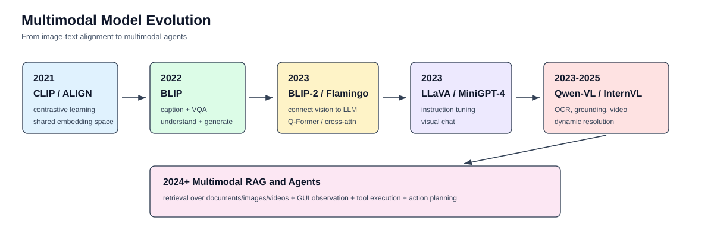

# 多模态模型结构总览

多模态模型的核心问题是：如何让模型同时理解图像、文字、视频、音频等不同形式的信息，并能用统一的语言接口回答问题、生成内容或执行动作。

如果只看图文模型，可以先抓住一条主线：

```text
Image
  -> Vision Encoder
  -> Visual Tokens
  -> Projector / Adapter / Q-Former / Cross-Attention
  -> LLM
  -> Text / Box / Action Output
```



## 一、为什么需要多模态模型

纯文本大语言模型只能处理文字 token。现实任务中，大量信息来自图片、截图、文档扫描件、表格、视频、医学影像、工业质检图片、App 或网页界面。

多模态模型要做的是把这些信息转成模型能理解的表示，并和文本问题一起推理。

## 二、最常见的图文模型结构

典型结构如下：

```text
输入图片
  -> 视觉编码器
  -> 视觉特征
  -> 连接模块
  -> 视觉 token
  -> 大语言模型
  -> 输出文本
```

其中最关键的不是 LLM 本身，而是中间的连接模块。

| 连接方式 | 代表模型 | 思路 |
|---|---|---|
| 对比学习对齐 | CLIP | 图像和文本分别编码到同一向量空间 |
| Q-Former | BLIP-2 | 用少量 query token 从视觉特征中提取信息 |
| MLP Projector | LLaVA | 把视觉特征映射到 LLM hidden size |
| Cross-Attention | Flamingo | LLM 通过跨注意力读取视觉特征 |
| Visual Adapter | Qwen-VL | 把视觉特征转成 Qwen LLM 可处理的视觉 token |

## 三、CLIP：图文对齐路线

CLIP 是多模态模型的重要起点。它不直接做对话，而是学习图像和文本的共同语义空间。


CLIP 的训练目标是：匹配的图片和文本向量更近，不匹配的图片和文本向量更远。

它带来的能力是开放词汇分类和图文检索，但它不是生成式视觉对话模型。

## 四、BLIP-2：Q-Former 连接视觉和语言模型


BLIP-2 的结构可以概括为：

```text
Frozen Vision Encoder
  -> Q-Former
  -> Frozen LLM
```

Q-Former 的价值是：用少量可学习 query 从图像 patch 特征中提取关键信息，降低视觉 token 数量，并把视觉信息接到语言模型上。

## 五、LLaVA：Projector 接入 LLM


LLaVA 使用更直接的结构：

```text
CLIP Vision Encoder
  -> MLP Projector
  -> LLaMA / Vicuna
  -> 文本回答
```

它的重要意义是证明：视觉编码器 + 轻量 projector + 多模态指令微调，就可以让 LLM 具备较强看图对话能力。

## 六、Qwen-VL：OCR、Grounding 和动态视觉能力


Qwen-VL 系列在图文对话基础上更强调 OCR、定位、文档和视频能力。

| 关键词 | 说明 |
|---|---|
| OCR | 读取图中文字 |
| Grounding | 文本和图像区域对齐，输出或理解 box |
| Dynamic Resolution | 根据图片大小动态生成视觉 token |
| MRoPE | 同时建模文本一维、图像二维、视频三维位置 |
| Dynamic FPS | 视频中动态控制采样帧 |

## 七、多模态训练任务

多模态模型不是只靠一类任务训练出来的。它通常需要多种任务共同塑造能力。


| 任务 | 作用 |
|---|---|
| ITC | 图文对比学习，建立语义空间 |
| ITM | 判断图片和文本是否匹配 |
| Caption | 看图生成描述 |
| VQA | 根据图片回答问题 |
| OCR | 读取图片中的文字 |
| Grounding | 文本短语和图像区域对齐 |
| SFT | 学会按照用户指令回答 |
| Video QA | 学习时间顺序和动作变化 |

## 八、多模态推理为什么更贵

图片进入模型后不是一个普通附件，而是会变成视觉 token。


推理成本可以这样理解：

```text
总上下文长度 = 文本 token + 视觉 token + 输出 token
```

所以高分辨率图片、多图输入和视频输入都会增加 prefill 延迟和 KV Cache 占用。

## 九、学习顺序

建议按这个顺序学习：

```text
CLIP
  -> BLIP / BLIP-2
  -> LLaVA
  -> Qwen-VL
  -> Qwen2-VL / Qwen2.5-VL
  -> 多模态 RAG / Agent
```

每一步重点看一个问题：

| 阶段 | 重点问题 |
|---|---|
| CLIP | 图文如何对齐 |
| BLIP-2 | 视觉特征如何压缩给 LLM |
| LLaVA | projector 如何接入 LLM |
| Qwen-VL | OCR 和 grounding 如何进入 VLM |
| Qwen2-VL | 动态分辨率和 MRoPE 如何处理高分辨率/视频 |
| Agent | 多模态模型如何观察环境并执行动作 |

