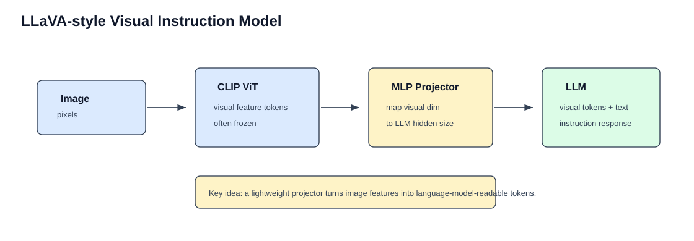
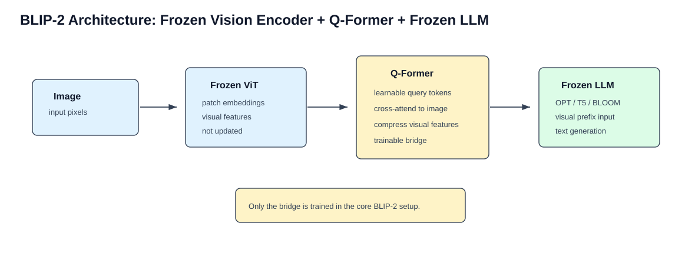
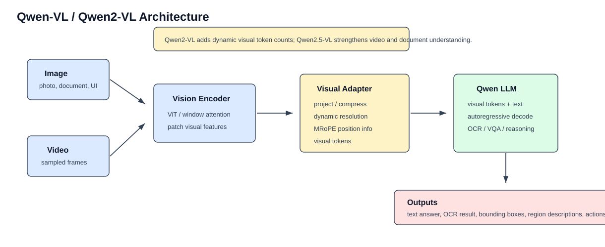

# 视觉编码器如何接入大语言模型

多模态大模型的关键问题是：图像编码器输出的是视觉特征，而大语言模型接收的是 token embedding。二者维度、语义和结构都不同，需要一个连接模块。

整体结构可以概括为：

```text
Image
  -> Vision Encoder
  -> Visual Features
  -> Bridge Module
  -> Visual Tokens
  -> LLM
```

## 一、为什么不能直接把图像给 LLM

LLM 接收的是：

```text
[batch, seq_len, hidden_size]
```

图像原始输入是：

```text
[batch, height, width, channels]
```

所以图像需要先经过视觉编码器变成 patch features，再映射到 LLM 的 hidden size。

## 二、Projector：LLaVA 路线



LLaVA 使用 CLIP Vision Encoder 提取视觉特征，再用 MLP Projector 映射到 LLM hidden size。

```text
Image
  -> CLIP ViT
  -> visual features
  -> MLP projector
  -> visual tokens
  -> LLM
```

优点：

- 结构简单；
- 训练成本低；
- 容易复现；
- 工程实现清晰。

缺点：

- 视觉 token 数量可能较多；
- 高分辨率和细粒度 OCR 需要额外设计；
- projector 本身压缩能力有限。

## 三、Q-Former：BLIP-2 路线



BLIP-2 使用 Q-Former 作为桥接模块。

Q-Former 里有一组可学习 query token：

```text
learnable queries
  -> cross-attention to image features
  -> compressed visual representation
```

它的作用是从大量视觉 patch 中提取少量关键视觉 token。

优点：

- 能压缩视觉信息；
- 视觉 token 数更可控；
- 适合冻结视觉编码器和语言模型。

缺点：

- 结构比 projector 复杂；
- query 数量影响信息瓶颈；
- 对细节保留能力取决于训练和 query 设计。

关于 Q-Former 的单独拆解，可以继续看：

[Q-Former结构详解](./Q-Former结构详解.md)

## 四、Cross-Attention：Flamingo 路线

Flamingo 类模型不是简单把视觉 token 拼进文本序列，而是在语言模型层中加入跨模态注意力。

```text
LLM hidden states
  -> cross-attention
  -> visual features
```

优点：

- LLM 可以在生成过程中多次读取视觉特征；
- 适合多图和上下文学习；
- 视觉特征不一定需要完全塞进文本序列。

缺点：

- 需要改造 LLM 结构；
- 训练和部署复杂度更高；
- 开源复现门槛更高。

## 五、Visual Adapter：Qwen-VL 路线



Qwen-VL 系列通过视觉编码器和适配模块把图片转成 Qwen LLM 可处理的视觉 token。

Qwen2-VL / Qwen2.5-VL 进一步强化：

- 动态分辨率；
- MRoPE；
- 视频时间维度；
- OCR 和文档理解。

这类模型的重点不是只把图像“接上去”，而是让视觉 token 支持更复杂的视觉任务。

## 六、几种连接方式对比

| 方式 | 代表模型 | 是否改 LLM | 视觉 token 控制 | 适合场景 |
|---|---|---:|---|---|
| Projector | LLaVA | 否 | 中等 | 简洁图文对话 |
| Q-Former | BLIP-2 | 否 | 强 | 参数高效视觉压缩 |
| Cross-Attention | Flamingo | 是 | 强 | 多图、少样本多模态 |
| Visual Adapter | Qwen-VL | 视实现而定 | 强 | OCR、Grounding、视频 |
